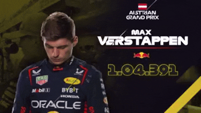
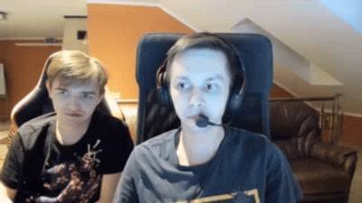

# WEB
ЛР по предмету "Разработка WEB-приложений"

[Задания на ЛР](https://github.com/Das-dasein/web-ssau/tree/main) 

# Лабораторная работа 1


Сдана ✔️

Для улучшения: 
- добавить свою ошибку (не использвать общий класс Exception e)
- не везде возращать ResponseEntity<>
  
# Лабораторная работа 2



Не сдана :x:

Создание БД

```sql
CREATE TABLE task (
    id BIGSERIAL PRIMARY KEY,
    title VARCHAR(255) NOT NULL,
    status VARCHAR(50) NOT NULL 
        CHECK (status IN ('OPEN', 'DONE', 'IN_PROGRESS', 'CLOSED')),
    created_by BIGINT NOT NULL,
    created_at TIMESTAMP NOT NULL DEFAULT CURRENT_TIMESTAMP

);
```

# Лабораторная работа 3
Не сдана :x:
# Лабораторная работа 4
Не сдана :x:
# Лабораторная работа 5



Не сдана :x:
# Если у вас остались вопросы по контрольным вопросам, то


